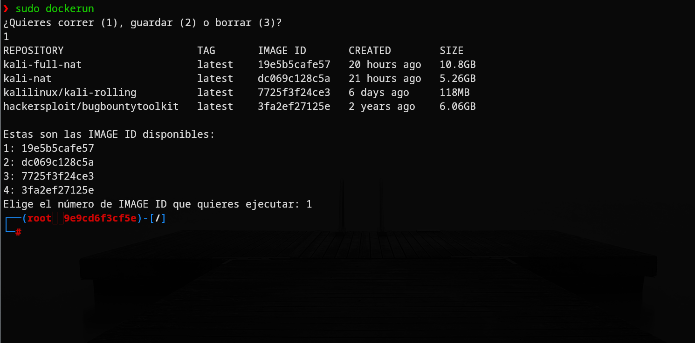
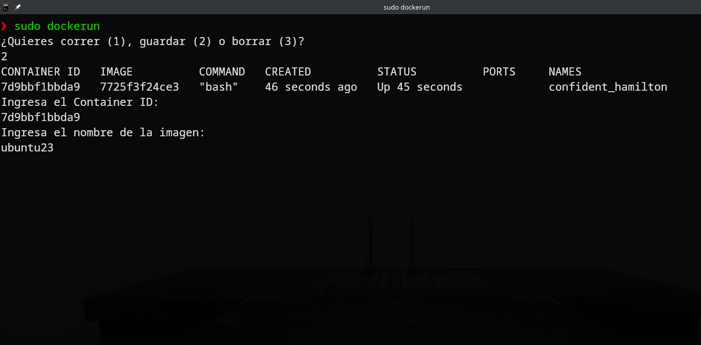
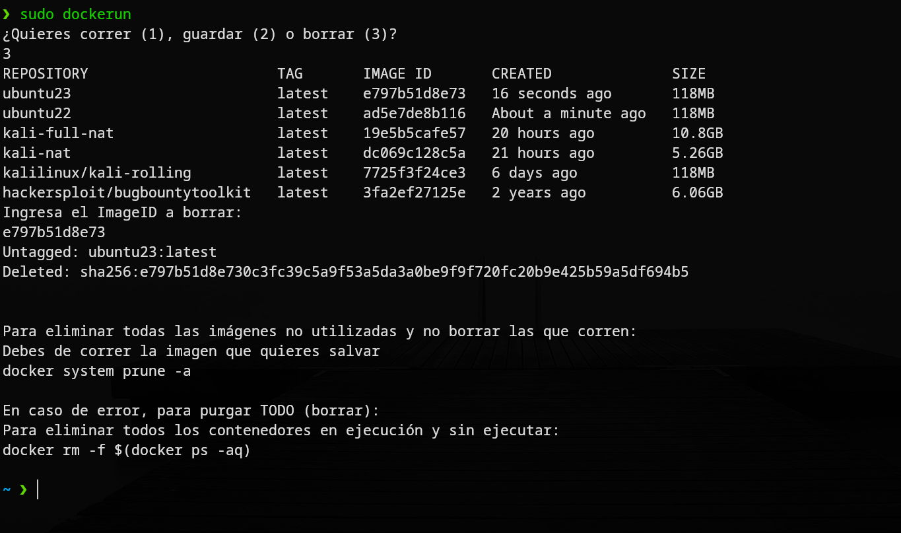

# Hi, I'm Havi! 👋


# Docker RuN

This script helps me access docker containers faster, especially when I don't remember the exact commands or I'm just lazy.

## Features

- Easy menu
- Just 2 words to execute a docker container or save or deleted
- Easy to remember
- Suggestions shown for deleting and purging when errors occur


## Usage/Examples

```javascript
1 2 3 for options

sudo dockerun
1 run
2 save
3 delete

```


## Screenshots






## Authors

- [@4rji](https://www.github.com/4rji/)


## Support

For support, email contact@arji.dev or join our Slack channel.


## Feedback

If you have any feedback, please reach out to us at havi@arji.dev

