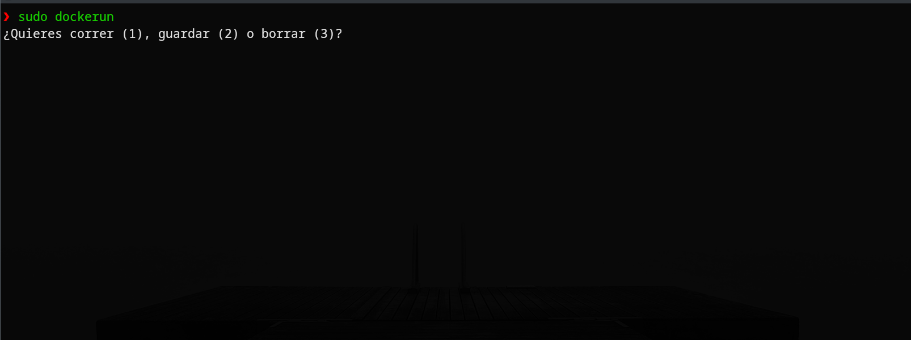

# Docker RuN

Este script me ayuda a acceder a contenedores docker mas rapido, en especial cuando no recuerdo los comandos exactos o simplemente estoy de flojo.


## Authors

- [@yomero](https://www.github.com/yomero)


## Deployment in zsh

To deploy this project run

```bash
sudo dockerun


## Screenshots



